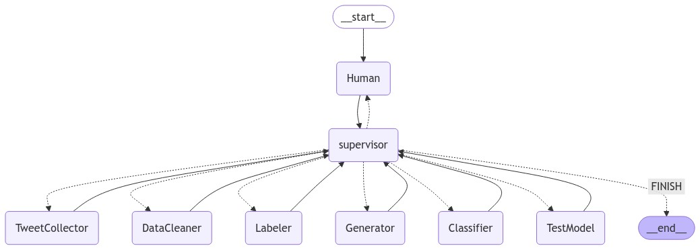

# Système Multi-Agents d'Analyse de Sentiments

## Description
Ce projet implémente un système multi-agents pour l'analyse de sentiments dans les tweets, utilisant différents agents spécialisés pour gérer les diverses étapes du processus d'analyse. Le système analyse les tweets pour déterminer s'ils expriment des sentiments positifs, négatifs ou neutres.

## Installation

1. Clonez le dépôt :
```bash
git clone https://github.com/djibrilIbnSaid/sentimentAnalysis.git
```

2. Accédez au répertoire du projet :
```bash
cd SentimentAnalysis
```

3. Créez et activez un environnement virtuel :
```bash
python3 -m venv env
source env/bin/activate
```
Sur Windows, utilisez `env\Scripts\activate` au lieu de `source env/bin/activate`.

4. Installez les dépendances :
```bash
pip install -r requirements.txt
```

5. Dépendances supplémentaires :
- Installez Ollama : Visitez https://ollama.com pour les instructions d'installation
- Vérifiez l'installation d'Ollama en accédant à http://localhost:11434 dans votre navigateur
- Téléchargez le modèle llama3.2 :
  ```bash
  ollama pull llama3.2
  ```

## Configuration des Identifiants Twitter

Pour utiliser le système de crawling Twitter, créez un fichier `.env` à la racine du projet avec vos identifiants Twitter :
```bash
  cp ./.env.exemple .env
```

```env
TWITTER_USERNAME=votre_nom_utilisateur
TWITTER_ACCOUNT_PASSWORD=votre_mot_de_passe
TWITTER_EMAIL=votre_email
TWITTER_EMAIL_PASSWORD=votre_mot_de_passe_email
```

## Utilisation
1. Exécutez le script d'analyse :
    ```bash
    python analyze.py
    ```
2. Les résultats seront affichés dans la console.

## Description des Agents

Le système est composé de plusieurs agents spécialisés pour gérer les différentes étapes du processus d'analyse de sentiments. Chaque agent est responsable d'une tâche spécifique et communique avec les autres agents pour coordonner le flux de travail.




### 1. HumanAgent (Agent Humain)
- Objectif : Sert de point d'entrée pour l'interaction utilisateur
- Fonction : Collecte le contexte et les requêtes des utilisateurs pour initier le workflow d'analyse
- Entrée : Texte fourni par l'utilisateur via une interaction en ligne de commande
- Sortie : Informations contextuelles pour les autres agents, formatées dans le state du workflow

### 2. SupervisorAgent (Agent Superviseur)
- Objectif : Orchestre le workflow entre les différents agents
- Fonction : Gère la séquence d'exécution des agents et contrôle le flux de travail
- Entrée : État du système (state) contenant les messages et résultats des agents
- Sortie : Décision sur le prochain agent à exécuter ou signal de terminaison (FINISH)
- Particularité : Maintient la cohérence du workflow et assure la transition appropriée entre les agents

### 3. TweetCollectorAgent (Agent Collecteur de Tweets)
- Objectif : Collecte des tweets par crawling direct sur Twitter
- Fonction : Utilise twscrape pour extraire les tweets correspondant aux critères de recherche
- Entrée : Requête de recherche et nombre de tweets souhaité
- Sortie : Fichier JSON contenant les tweets collectés avec leurs métadonnées
- Particularité : Effectue un crawling direct plutôt qu'une utilisation de l'API Twitter, permettant une collecte plus flexible

  NB: si le télèchargement échoue, l'agent charge les tweets deja télècharges dans le fichier `data/tweets.json`. Les tweets concernes le sujet "Gouvernement de Michel Barnier".

### 4. DataCleaningAgent (Agent de Nettoyage de Données)
- Objectif : Prétraite et nettoie les tweets collectés
- Fonction : Applique diverses opérations de nettoyage sur les tweets
- Entrée : Fichier JSON contenant les tweets bruts
- Sortie : Dataset nettoyé au format CSV
- Opérations : 
  * Suppression des URLs
  * Suppression des mentions (@user)
  * Suppression des caractères spéciaux
  * Conversion en minuscules
  * Suppression des doublons

### 5. LabelingAgent (Agent d'Étiquetage)
- Objectif : Attribue des étiquettes de sentiment aux tweets
- Fonction : Utilise le modèle Llama via Ollama pour l'analyse des sentiments
- Entrée : Dataset de tweets nettoyés
- Sortie : Dataset avec étiquettes de sentiment (POSITIVE, NEGATIVE, NEUTRAL)
- Particularité : Utilise un prompt spécialement conçu pour l'analyse de sentiments en français

### 6. GeneratorTweetAgent (Agent Générateur de Tweets)
- Objectif : Équilibre le dataset en générant des tweets additionnels
- Fonction : Génère de nouveaux tweets pour les catégories sous-représentées
- Entrée : Dataset de tweets étiquetés
- Sortie : Dataset augmenté (tweets_dataset_aug.csv)
- Fonctionnalités :
  * Analyse la distribution des sentiments
  * Calcule le nombre de tweets à générer par catégorie
  * Utilise Llama pour générer des tweets cohérents
  * Maintient le contexte et le style des tweets originaux

### 7. ClassifierAgent (Agent de Classification)
- Objectif : Développe et entraîne un modèle de classification des sentiments
- Fonction : Implémente un réseau de neurones pour la classification
- Entrée : Dataset augmenté et équilibré
- Sortie : Modèle entraîné (tweet_classifier.h5) et tokenizer (tokenizer.pkl)
- Caractéristiques :
  * Architecture de réseau neuronal convolutif
  * Gestion du déséquilibre des classes
  * Métriques de performance (précision, rappel)
  * Sauvegarde automatique du meilleur modèle

### 8. TestModelAgent (Agent de Test du Modèle)
- Objectif : Permet de tester le modèle entraîné
- Fonction : Interface interactive pour tester de nouveaux tweets
- Entrée : Tweets fournis par l'utilisateur
- Sortie : Prédictions de sentiment avec visualisation des probabilités
- Particularité : Inclut une visualisation graphique des résultats

## Structure des Sorties

Le système génère les fichiers suivants pendant l'exécution :
- `data/tweets.json` : Tweets collectés par crawling
- `data/tweets_dataset_clean.csv` : Données de tweets nettoyées
- `data/tweets_labeled.csv` : Tweets étiquetés avec sentiments
- `data/tweets_dataset_aug.csv` : Dataset augmenté avec tweets générés
- `data/tweet_classifier.h5` : Modèle entraîné
- `data/tokenizer.pkl` : Tokenizer de texte

## Gestion des Erreurs

Le système intègre une gestion robuste des erreurs courantes :
- Échecs de connexion lors du crawling Twitter
- Erreurs de traitement des données
- Problèmes d'entraînement du modèle
- Formats d'entrée invalides
- Erreurs de génération de tweets

## Contributeurs
- Abdoulaye Djibril DIALLO
- Salma KHALLAD
- Alexandre ARNAUD
- Ayoub HIDARA

## Licence
Ce projet est sous licence MIT - voir le fichier LICENSE pour plus de détails.